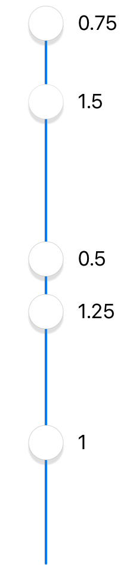

# MultiSlider
UISlider clone with multiple thumbs and values, range highlight, optional snap intervals, optional value labels, either vertical or horizontal.

[![Swift Version][swift-image]][swift-url]
[![Build Status][travis-image]][travis-url]
[![License][license-image]][license-url]
[](https://img.shields.io/cocoapods/v/MultiSlider.svg)
[](http://cocoapods.org/pods/MultiSlider)
[](http://makeapullrequest.com)


<p align="center">

</p>

## Features

* Multiple thumbs
* Range slider (optional) - track color between thumbs different from track color outside thumbs
* Vertical (optional)
* Value labels (optional)
* Snap interval (optional)
* Haptic feedback
* Configurable thumb image, minimum and maximum images.
* Configurable track width, color, rounding.

## Usage

```swift
let slider = MultiSlider()
slider.minimumValue = 1    // default is 0.0
slider.maximumValue = 5    // default is 1.0

slider.value = [1, 4.5, 5]

slider.addTarget(self, action: #selector(sliderChanged(_:)), for: .valueChanged) // continuous changes
slider.addTarget(self, action: #selector(sliderDragEnded(_:)), for: . touchUpInside) // sent when drag ends
```

### SwiftUI

Use `MultiValueSlider` from the [swiftui branch](https://github.com/yonat/MultiSlider/tree/swiftui).

### Getting multiple thumb values

Use `value` to get all thumbs values, and `draggedThumbIndex` to find which thumb was last moved.

```swift
func sliderChanged(slider: MultiSlider) {
    print("thumb \(slider.draggedThumbIndex) moved")
    print("now thumbs are at \(slider.value)") // e.g., [1.0, 4.5, 5.0]
}
```

### Range slider

```swift
slider.outerTrackColor = .lightGray // outside of first and last thumbs
```

### Vertical / horizontal orientation

```swift
slider.orientation = .horizontal // default is .vertical
slider.isVertical = false // same effect, but accessible from Interface Builder
```

### Value labels

```swift
slider.valueLabelPosition = .left // .notAnAttribute = don't show labels
slider.isValueLabelRelative = true // show differences between thumbs instead of absolute values
slider.valueLabelFormatter.positiveSuffix = " 𝞵s"
```

### Snap interval

```swift
slider.snapStepSize = 0.5 // default is 0.0, i.e. don't snap
slider.isHapticSnap = false // default is true, i.e. generate haptic feedback when sliding over snap values
```

### Changing Appearance

```swift
slider.tintColor = .cyan // color of track
slider.trackWidth = 32
slider.hasRoundTrackEnds = true
slider.showsThumbImageShadow = false // wide tracks look better without thumb shadow
```

### Images

```swift
slider.thumbImage   = UIImage(named: "balloon")
slider.minimumImage = UIImage(named: "clown")
slider.maximumImage = UIImage(named: "cloud")
```

### Disabling/freezing thumbs

```swift
slider.disabledThumbIndices = [1, 3]
```

## Requirements

- iOS 9.0+
- Xcode 10

## Installation

### CocoaPods:

```ruby
pod 'MultiSlider'
```

Legacy versions:

| Swift version | MultiSlider version |
| :---: | :--- |
| 4.0 (Xcode 9.4) | `pod 'MiniLayout', '~> 1.2.1'`<br>`pod 'MultiSlider', '~> 1.6.0'` |
| 3 | `pod 'MiniLayout', '~> 1.1.0'`<br>`pod 'MultiSlider', '~> 1.1.2'` |
| 2.3 | `pod 'MiniLayout', '~> 1.0.1'`<br>`pod 'MultiSlider', '~> 1.0.1'` |

### Swift Package Manager:

```swift
dependencies: [
    .package(url: "https://github.com/yonat/MultiSlider", from: "1.10.7")
]
```

## Meta

[@yonatsharon](https://twitter.com/yonatsharon)

[https://github.com/yonat/MultiSlider](https://github.com/yonat/MultiSlider)

[swift-image]:https://img.shields.io/badge/swift-5.0-orange.svg
[swift-url]: https://swift.org/
[license-image]: https://img.shields.io/badge/License-MIT-blue.svg
[license-url]: LICENSE.txt
[travis-image]: https://img.shields.io/travis/dbader/node-datadog-metrics/master.svg?style=flat-square
[travis-url]: https://travis-ci.org/dbader/node-datadog-metrics
